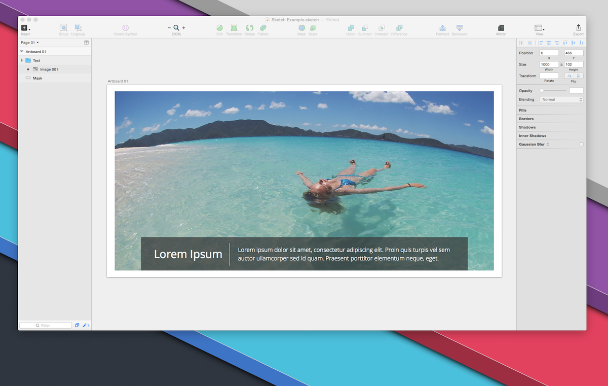

# ImageLoader

With this Sketch plugin you can update all the Image Layers with new images from Finder with one click!

## How to use

Setup your Sketch project with an Image Layer with the same name as the source file: **Image 001**

Start the plugin and choose the folder with new images

Enjoy the magic. Your Image Layer is now updated with the new image file

