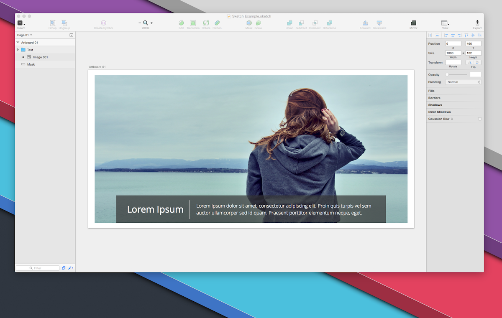
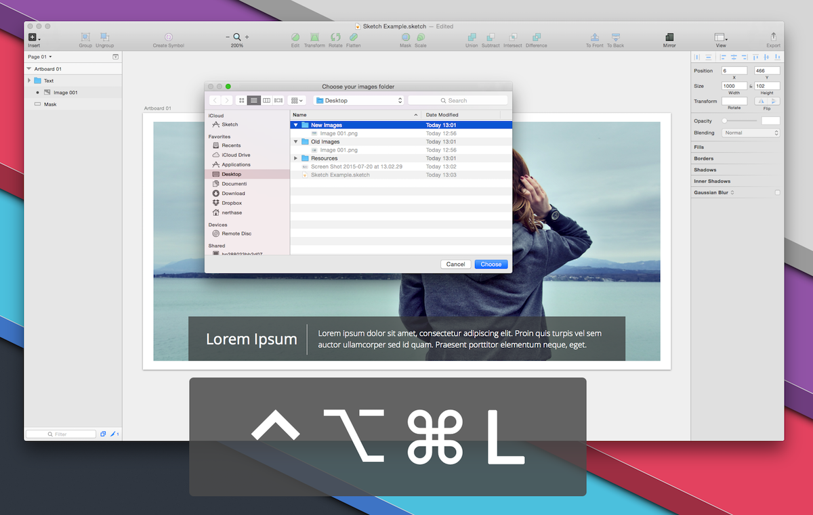

# ImageLoader

With this Sketch plugin you can update all the Image Layers with new images from Finder with one click!

## How to use

## Download

You can download Image Loader Sketch plugin here
